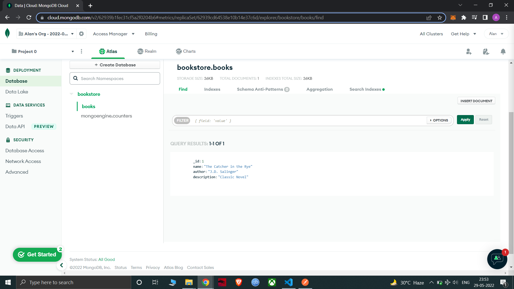

# books-crud
Flask RESTAPI that uses MongoDB to create, read, update and delete books.

## Installation:
1. Create an virtual environment ```python -m venv venv```
2. Activate the [virtual environment](https://docs.python.org/3/tutorial/venv.html). 
3. ```pip install -r requirements.txt```
4. Create a .env file for storing environment variables:
```
FLASK_APP=run
FLASK_ENV=development
DATABASE_NAME=NameOfTheDatabase
PASSWORD=PasswordForTheDatabase
```
6. ```flask run```

## Screenshots:

### Create Book:


### Read Books:


### Update Book:


### Delete Book:

